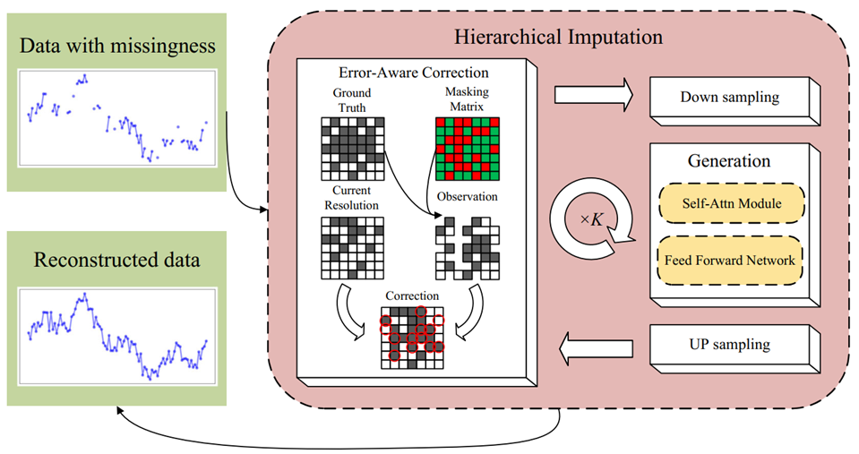
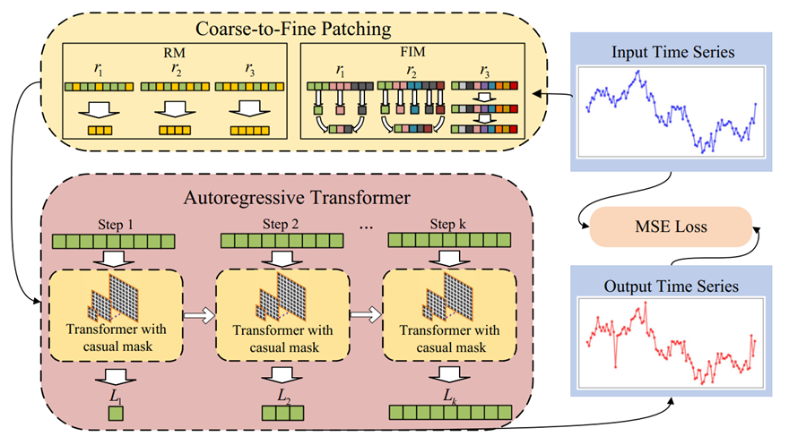
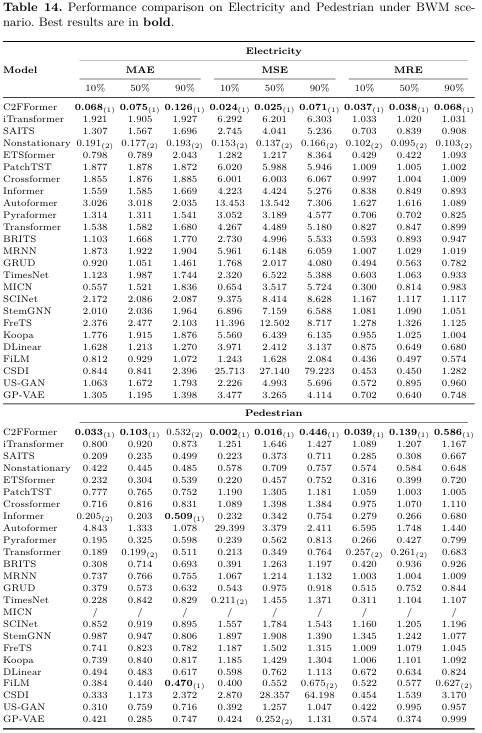
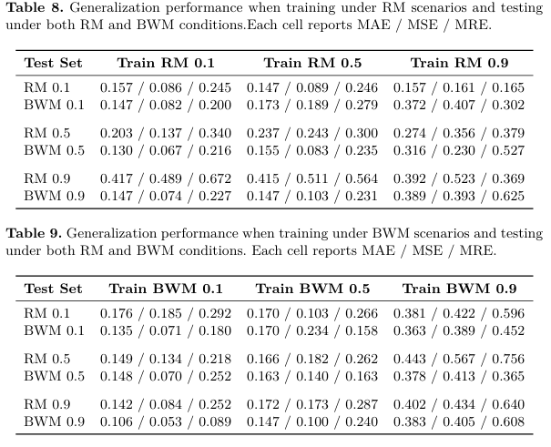
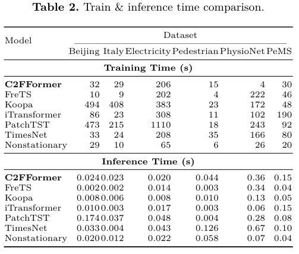

# C2FFormer: Coarse-to-Fine Time Series Imputation via Autoregressive Transformer


# Abstract

Time series imputation is a fundamental task across a wide range of scientific and industrial domains. In many real-world scenarios, the proportion of missing data is highly variable and often exhibits block-wise missing patterns. This poses a significant challenge for existing imputation methods, which are designed for fixed missing rates and can only perform well in randomly missing scenario. Inspired by the autoregressive training paradigm of language models that emulate human reasoning, we propose a novel Transformer-based imputation framework featuring a coarse-to-fine reconstruction strategy. **Specifically, the original sequence is discretized into multi-resolution patches, and the model is trained to predict finer-grained sequences conditioned on coarser ones via autoregressive attention with causal masking.** This progressive training enables the Transformer to capture multi-scale temporal patterns and understand underlying time series structures, thereby equipping it with zero-shot inference capability. It enables strong generalization across different missing rates and robust inference under block-wise missingness. We conduct extensive experiments on four real-world datasets and compare our method with 24 recent baselines. The results demonstrate our model, once trained, achieves consistently high imputation accuracy across various missing rates. Remarkably, in challenging block-missing scenarios, our method reduces imputation error by up to 46.7\% compared to the best-performing baseline. 

# overview of C2FFormer

<div style="display: flex; justify-content: space-between;">
  
  
</div>


Training and inference process of C2FFormer: Left: The input sequence is first discretized into multi-resolution patches using two types of patching strategies; then, an autoregressive Transformer learns the dependencies across resolutions; finally, the model is optimized using the MSE loss between the predicted and ground-truth sequences. Right: The sequence with missing values is progressively imputed with K steps. At each step, an error correction mechanism refines the predictions, leading to the final reconstructed sequence.

# Requirements

```
torch>=2.3.0
torch>=2.3.0
torchvision>=0.18.0
numpy>=1.26.4
pandas>=2.2.3
scipy>=1.15.2
scikit-learn>=1.6.1
transformers>=4.49.0
tokenizers>=0.21.0
safetensors>=0.5.3
huggingface-hub>=0.29.1
tqdm>=4.66.2
pyyaml>=6.0.1
```

## Datasets

We evaluate our method on six real-world time series datasets: **Beijing Air**, **Italy Air**, **Electricity**, **Pedestrian**, **PhysioNet**, and **PeMS**. These datasets span six distinct domains—air quality, urban pedestrian flow, electricity consumption, road traffic, and physiological signals—and are all retrieved from [TSDB](https://github.com/WenjieDu/TSDB)

# Train and Infernce

```
python train.py
```

# Experiments

## 1. Baseline

We evaluate the performance of C2FFormer and the baseline methods, under two missing data scenarios: Random Missing (RM) and Block-wise Missing (BWM). 





## 2. Ablation Study

To assess the effectiveness of the core components in C2FFormer, we conduct ablation studies by removing either the Error Correction (EC) module or the Autoregressive Patching (AP) mechanism, evaluated on six datasets across both random missing and block-wise missing scenarios under all missing rates.


## 2. Generalization Study

To evaluate the generalization capability of C2FFormer, we conduct experiments on the Italy air dataset: models are trained under a specific missing pattern (eithe RM or BWM) at a fixed rate, and then tested under both RM and BWM conditions across all missing rates (10\%, 50\%, 90\%).



## 3. Train&Inference Time

we compares the training and inference time of different imputation methods. 




