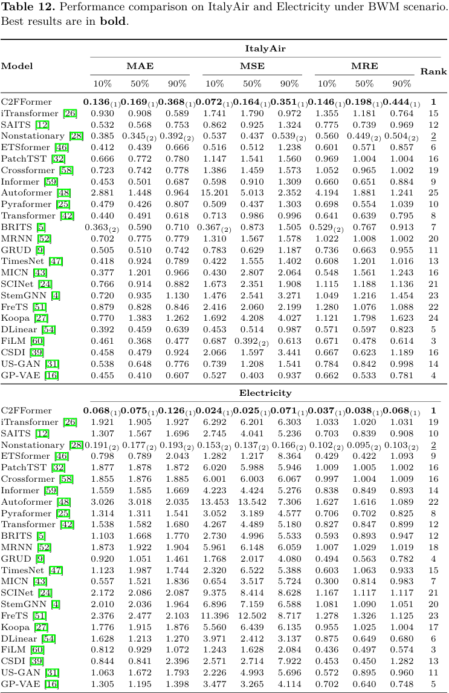
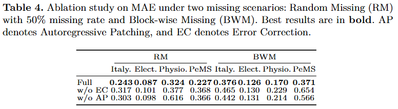
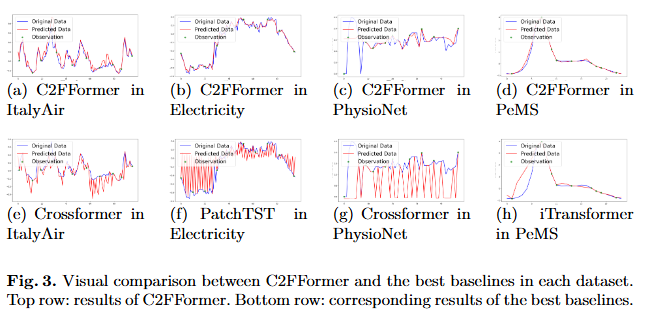

# C2FFormer: Coarse-to-Fine Time Series Imputation via Autoregressive Transformer


# Abstract

Time series imputation is essential in many scientific and industrial applications. However, real-world data often exhibit highly variable and block-wise missing patterns, posing challenges to existing methods that assume fixed missing rates and perform well only under random missingness. Inspired by autoregressive training paradigm of language models that emulate human reasoning, we propose a Transformer-based imputation framework with a coarse-to-fine reconstruction strategy. The input series is firstly discretized into multi-resolution patches, and the model then autoregressively predicts fine-grained sequences from coarser representations using causal attention. This progressive training enables the model to capture multi-scale temporal structures and supports zero-shot inference across varying missing scenarios. Experiments on four real-world datasets against 24 recent baselines show that, once trained, our method can be directly applied to diverse missing scenarios, consistently achieves high accuracy, and reduces imputation error by up to 95.09% in challenging block-missing settings. 

# overview of C2FFormer

<div style="display: flex; justify-content: space-between;">
  
  
</div>


Training and inference process of C2FFormer: Left: The input sequence is first discretized into multi-resolution patches using two types of patching strategies; then, an autoregressive Transformer learns the dependencies across resolutions; finally, the model is optimized using the MSE loss between the predicted and ground-truth sequences. Right: The sequence with missing values is progressively imputed with K steps. At each step, an error correction mechanism refines the predictions, leading to the final reconstructed sequence.

# Requirements

```
torch>=2.3.0
torch>=2.3.0
torchvision>=0.18.0
numpy>=1.26.4
pandas>=2.2.3
scipy>=1.15.2
scikit-learn>=1.6.1
transformers>=4.49.0
tokenizers>=0.21.0
safetensors>=0.5.3
huggingface-hub>=0.29.1
tqdm>=4.66.2
pyyaml>=6.0.1
```

## Datasets

We conduct experiments on four real world datasets: Italy Air, Electricity, PhysioNet and PeMS. They come from four domains: environmental monitoring, energy system, healthcare and road traffic, and are all retrieved from [TSDB](https://github.com/WenjieDu/TSDB)

# Train and Infernce

```
python train.py
```

# Experiments

## 1. Baseline

We compare our proposed method with a large quantity of time series analysis baselines, covering RNNs (MRNN, BRITS, GRUD), GANs (USGAN), Transformers (Transformer, iTransformer, ETSformer, Crossformer, Informer, Autoformer, PatchTST), diffusion-based models (CSDI), GNNs (StemGNN), frequency-based models (FreTS, FILM), and other classical models (SAITS, TimesNet, MICN, SCINet, Koopa, DLinear, GP-VAE). Due to space constraints, the main paper presents results only for the six best-performing baselines—CSDI, iTransformer, Crossformer, PatchTST, FreTS, and Koopa—while the complete comparison with all baselines is provided on GitHub.





## 2. Ablation Study

To evaluate the contribution of the key components in C2FFormer, we perform ablation experiments by removing the Error Correction (EC) module and the Autoregressive Patching (AP) mechanism individually. Table below reports the results under RM with 50% missing rates and BMW scenarios. Removing the EC module and AP mechanism increases MAE by 31.25% and 47.17%, respectively, in the RM scenario, while in BMW the increases reach 34.46% and 24.99%. These results demonstrate that both EC and AP are essential for achieving accurate imputation. AP is particularly important for handling imputation under the BMW scenario, while EC provides consistent accuracy improvements in both RM and BMW settings.



## 3. Generalization Study Across Missing Scenarios

This section poses a more challenging test of C2FFormer's generalization ability, evaluating whether it can transfer across different missing scenarios. Specifically, C2FFormer is trained under the BMW setting and then tested on RM to assess its capability to produce correct imputations without retraining. From the table, C2FFormer shows strong adaptability across different missing scenarios, achieving performance almost identical to that obtained when trained under the RM settings, with relative differences below 5% across all metrics. This demonstrates its strong generalization capability, enabling accurate imputation at varying missing rates and scenarios with only a single training process.


## 4.Visual comparison



